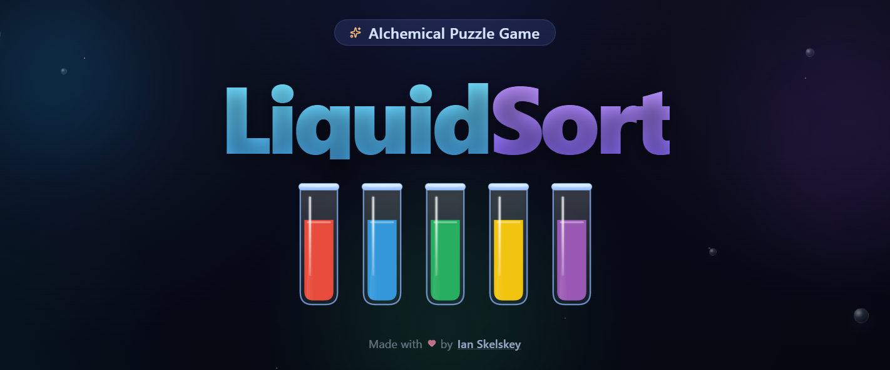

# Liquid Sort

A puzzle game where you sort colored liquids into vials so that each vial contains only one color. Tap a vial to pick it up, then tap another to pour - matching colors stack together. Clear every vial to advance to the next level.

**[Play Now](https://ianskelskey.github.io/liquid-sort/)**

## Features

- 10 distinct liquid colors across increasingly challenging levels
- Automatic dark/light mode based on system preferences
- Coin economy - earn coins by completing levels efficiently
- Power-ups: Undo, Shuffle, and Add Vial
- No-moves-left detection with recovery options
- Mobile-responsive design
- Smooth animations and visual feedback
